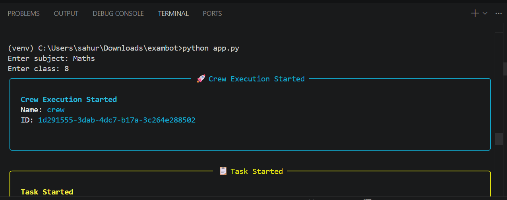
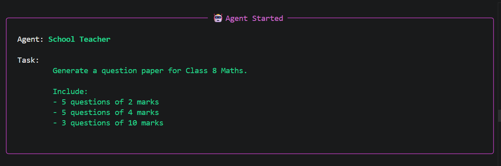
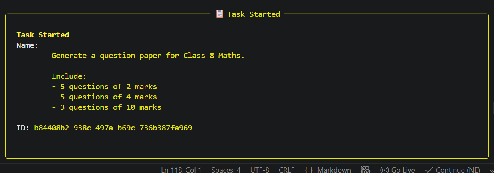
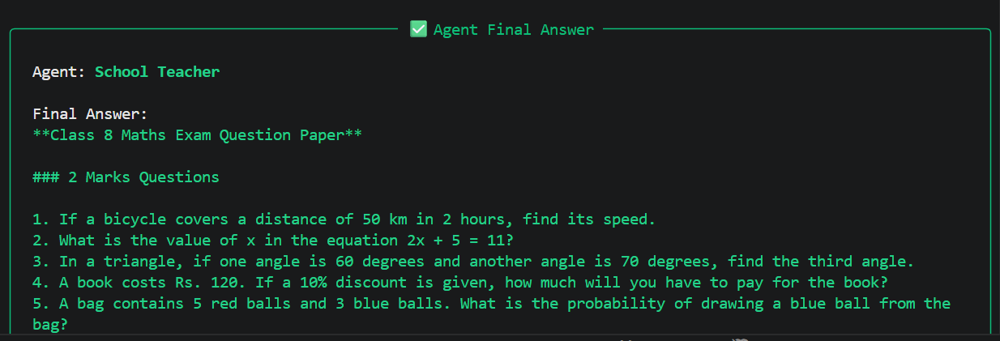

# 🚀 CrewAI Question Paper Generator

An AI-powered multi-agent system that generates structured question papers using CrewAI.

---

## 📌 Project Overview

This project uses **CrewAI** to build a multi-agent system where different AI agents collaborate to generate a complete question paper based on user input like class and subject.

Instead of relying on a single LLM, this system divides responsibilities across multiple agents to improve accuracy, structure, and output quality.

---

## 🧠 How It Works

The system consists of multiple AI agents, each with a specific role:

* **Subject Agent** → Understands subject context
* **Class Agent** → Determines difficulty level
* **Question Generator Agent** → Generates questions (2, 4, 10 marks)

### 🔄 Workflow:

1. User provides input (class & subject)
2. Input is processed by Subject & Class agents
3. Data is passed to Question Generator agent
4. Final structured question paper is generated

---

## ⚙️ Tech Stack

* CrewAI (Multi-Agent System)
* FastAPI (Backend API)
* Python
* LLM APIs (OpenAI / Groq)
* Prompt Engineering

---

## 🚀 Features

* Multi-agent collaboration using CrewAI
* Generates structured question papers
* Supports different mark distributions (2, 4, 10 marks)
* Scalable architecture for AI workflows

---

## 📂 Project Structure

```
EXAMBOT/
│── agents/        # Agent definitions
│── tasks/         # Task logic for agents
│── crew/          # CrewAI orchestration
│── config/        # Configuration files
│── ui/            # (Optional UI layer)
│── app.py         # Main FastAPI application
│── requirements.txt
│── .env           # Environment variables (not included)
```

---

## 🔐 Environment Setup

Create a `.env` file and add your API keys:

```
OPENAI_API_KEY=your_key_here
GROQ_API_KEY=your_key_here
```

---

## ▶️ How to Run

```bash
# Install dependencies
pip install -r requirements.txt

# Run the application
python app.py
```

---

## 💡 Key Learnings

* Multi-agent system design using CrewAI
* Agent orchestration and collaboration
* Prompt engineering for structured outputs
* Building AI-powered backend systems

---

## 🔮 Future Improvements

* Add RAG for context-aware question generation
* Integrate database for storing previous papers
* Build frontend UI for better interaction
* Add export options (PDF/Docx)

---

## 📸 Output Screenshots

### Sample 1


### Sample 2


### Sample 3


### Sample 4


## 👨‍💻 Author

Rocky Sahu
GitHub: https://github.com/Rockysahu704

---

## ⭐ If you like this project

Give it a ⭐ on GitHub!
